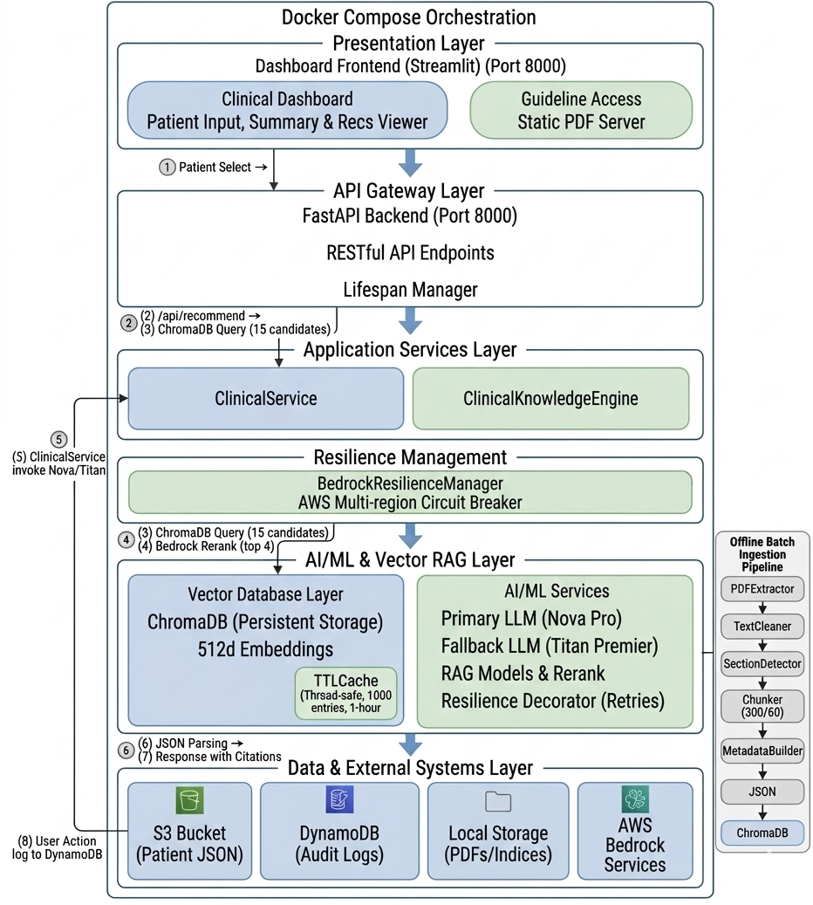

# EviCare: an AI-powered cognitive co-pilot for critical care decisions

[](https://www.python.org/downloads/)
[](https://aws.amazon.com/)
[](https://fastapi.tiangolo.com/)
[](https://streamlit.io/)

EviCare is an enterprise-grade clinical decision support system that provides real-time, evidence-based treatment recommendations for Type 2 Diabetes and Hypertension management. Built on AWS Bedrock with multi-region resilience, it transforms clinical guidelines (ICMR) into actionable, patient-specific protocols.

## 🎯 Key Features

- **Citation-Backed Recommendations**: Every suggestion linked to verified clinical guidelines with PDF source
- **Human-in-the-loop Validation**: Accept/Modify/Reject the recommendation before audit log
- **Knowledge Graph Analysis**: Automated pathophysiology mapping for multi-morbidity risk detection
- **Model Resilience**: Multi-region failover across 3 AWS regions with automated model fallback
- **Cost-Optimized**: Thread-safe caching reduces API costs by 60-70%
- **Audit Compliance**: Full DynamoDB logging for HIPAA-compliant clinical decision tracking
- **Rapid Deployment**: Streamlit interface requires zero IT training

## 🏗️ Architecture

| Architecture Diagram
|------------|
|   

## 🚀 Quick Start

### Prerequisites

- Python 3.9+
- AWS Account with Bedrock access
- Docker & Docker Compose (optional)

### Installation

1. **Clone the repository**
```bash
git clone https://github.com/yourusername/evicare.git
cd evicare
```

2. **Install dependencies**
```bash
pip install -r requirements.txt
```

3. **Configure AWS credentials**
```bash
# Create .env file
cat > .env << EOF
AWS_ACCESS_KEY_ID=your_access_key
AWS_SECRET_ACCESS_KEY=your_secret_key
AWS_DEFAULT_REGION=us-east-1
BEDROCK_PRIMARY_REGION=us-east-1
BEDROCK_FALLBACK_GENERATION=amazon.titan-text-premier-v1:0
EOF
```

4. **Ingest clinical guidelines**
```bash
# Process PDF guidelines into vector database
python ingestion/main.py "data/pdfs/ICMR.diabetesGuidelines.2018.pdf" "ICMR" "ICMR Guidelines for Management of Type 2 Diabetes" "India"

# Generate embeddings and populate ChromaDB
python vector_db/chroma_setup.py
```

Here:
- "ICMR" --> Guideline organisation 
- "ICMR Guidelines for Management of Type 2 Diabetes" --> Guideline name
- "India" --> country context or global


5. **Launch the application**

**Option A: Local Development**
```bash
# Terminal 1: Start backend
uvicorn backend.main:app --host 0.0.0.0 --port 8000

# Terminal 2: Start frontend
streamlit run frontend/main.py --server.port 8501
```

**Option B: Docker Compose**
```bash
docker-compose up --build
```

6. **Access the dashboard**
- Frontend: http://localhost:8501
- Backend API: http://localhost:8000/docs
- Health Check: http://localhost:8000/health

## 📊 Usage

### Clinical Workflow

1. **Select Patient**: Choose from cloud-stored patient registry (S3) or add new patient details
2. **Review Summary**: View clinical data, lab results, and risk factors. Also view knowledge graph insights if extracted.
3. **Generate Recommendations**: Click "Generate AI Recommendations"
4. **Review Evidence**: Examine the recommendation along with its confidence score, reasoning, and guideline citations. 
5. **Take Action**: Accept, Modify, or Reject recommendations (logged to DynamoDB)

### Adding New Patients

Use the sidebar "Add New Patient" form to create patient records with:
- Demographics (ID, Name, Age, Sex)
- Diagnoses and symptoms
- Lab results (HbA1c, glucose, BP, lipids, renal function)
- Current medications and lifestyle factors

## 🔧 Configuration

### Environment Variables

| Variable | Description | Default |
|----------|-------------|---------|
| `AWS_ACCESS_KEY_ID` | AWS credentials | Required |
| `AWS_SECRET_ACCESS_KEY` | AWS credentials | Required |
| `BEDROCK_PRIMARY_REGION` | Primary AWS region | `us-east-1` |
| `BEDROCK_FALLBACK_GENERATION` | Fallback LLM model | `amazon.titan-text-premier-v1:0` |
| `DOCKER_RUNNING` | Docker environment flag | `false` |

### AWS Services Configuration

**Required IAM Permissions:**
```json
{
  "Version": "2012-10-17",
  "Statement": [
    {
      "Effect": "Allow",
      "Action": [
        "bedrock:InvokeModel",
        "bedrock:Converse",
        "bedrock-agent:Rerank",
        "s3:GetObject",
        "s3:PutObject",
        "dynamodb:PutItem",
        "dynamodb:Query",
        "dynamodb:Scan"
      ],
      "Resource": "*"
    }
  ]
}
```


## 📁 Project Structure

```
evicare/
├── backend/
│   ├── main.py                 # FastAPI application entry
│   ├── routes.py               # API endpoints
│   ├── services.py             # ClinicalService (LLM orchestration)
│   ├── resilience_utils.py     # Multi-region failover & retries
│   └── schemas.py              # Pydantic models
├── frontend/
│   ├── main.py                 # Streamlit dashboard
│   ├── clinical_graph.py       # Knowledge graph engine
│   └── s3_utils.py             # S3/DynamoDB utilities
├── ingestion/
│   ├── main.py                 # Pipeline orchestrator
│   ├── pdf_extractor.py        # PDF text extraction
│   ├── cleaner.py              # Clinical text preprocessing
│   ├── section_detector.py     # Guideline section filtering
│   ├── chunker.py              # Sentence-aware chunking
│   └── metadata_builder.py     # Metadata enrichment
├── vector_db/
│   ├── chroma_setup.py         # ChromaDB ingestion
│   ├── retriever.py            # Vector search + reranking
│   └── chunk_data/             # Persistent vector store
├── data/
│   └── pdfs/                   # Clinical guideline PDFs
├── Dockerfile
├── docker-compose.yml
├── entrypoint.sh
├── requirements.txt
└── README.md
```

## 🛡️ Resilience Features

### Multi-Region Failover
- **Regions**: us-east-1 → us-west-2 → eu-central-1
- **Automatic Switching**: On throttling, service unavailability, or model errors
- **Circuit Breaker**: Prevents cascading failures with health tracking

### Model Fallback Strategy
1. **Primary**: Amazon Nova Pro (amazon.nova-pro-v1:0)
2. **Fallback**: Amazon Titan Text Premier (amazon.titan-text-premier-v1:0)
3. **Graceful Degradation**: Returns safe fallback recommendations on total failure

### Exponential Backoff
- **Retries**: 3 attempts per operation
- **Delays**: 1s → 2s → 4s
- **Scope**: Embeddings, LLM inference, reranking

### Caching Layer
- **Type**: Thread-safe TTLCache
- **Capacity**: 1000 entries
- **TTL**: 1 hour
- **Impact**: 60-70% API cost reduction

## 💰 Cost Optimization

| Technique | Impact |
|-----------|--------|
| TTL Caching | 60-70% API cost reduction |
| 512-dim embeddings | 50% storage cost vs 1024-dim |
| Regional failover | Prevents expensive retry loops |
| Model fallback | Avoids premium model overuse |
| Batch rate limiting | Prevents throttling charges |


## 📈 Performance Metrics

- **Average Response Time**: 3.5s seconds 
- **Retrieval Precision**: 82% (top4 chunks)
- **Clinical Relevancy**: 76% (guideline alignment)
- **Time Reduction**: 60%  (average guideline look-up reduction)

Manually tested across 100 synthetic patient data for diabetes and hypertension with ICMR guidelines on EC2 t3.micro instance.

## 🔒 Security & Compliance

- **HIPAA-Ready**: Audit logging with DynamoDB
- **Data Encryption**: At-rest (S3/DynamoDB) and in-transit (TLS)
- **Access Control**: IAM role-based permissions
- **PHI Handling**: No patient data stored in logs or caches
- **Audit Trail**: Full decision history with timestamps


## 🙏 Acknowledgments

- **Clinical Guidelines**: WHO, ICMR, International Diabetes Federation
- **AI Models**: Amazon Bedrock (Nova Pro, Titan)
- **Vector Database**: ChromaDB
- **Framework**: FastAPI, Streamlit


## 🗺️ Roadmap

- [ ] Additional conditions (COPD, cardiovascular disease, oncology)
- [ ] EHR integration (Epic, Cerner FHIR APIs)
- [ ] Mobile application (iOS/Android)
- [ ] Real-time guideline update monitoring
- [ ] Federated learning for privacy-preserving model improvement
- [ ] Managed scaling via AWS ECS Fargate
- [ ] Multimodal acceptance (X-ray, ECG etc)

---

**Built with ❤️ for better healthcare outcomes**


